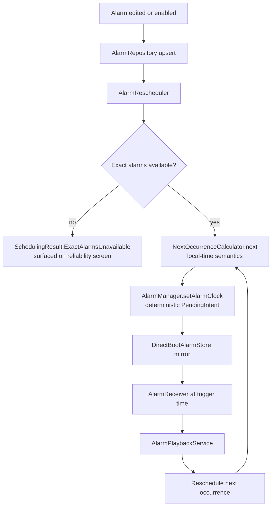
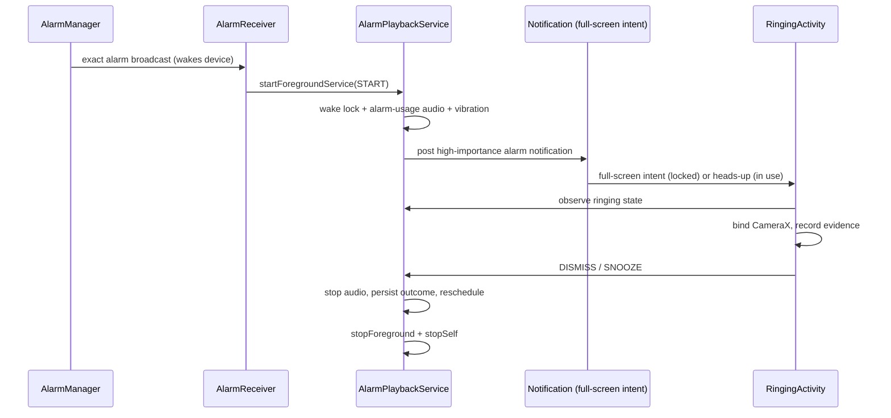
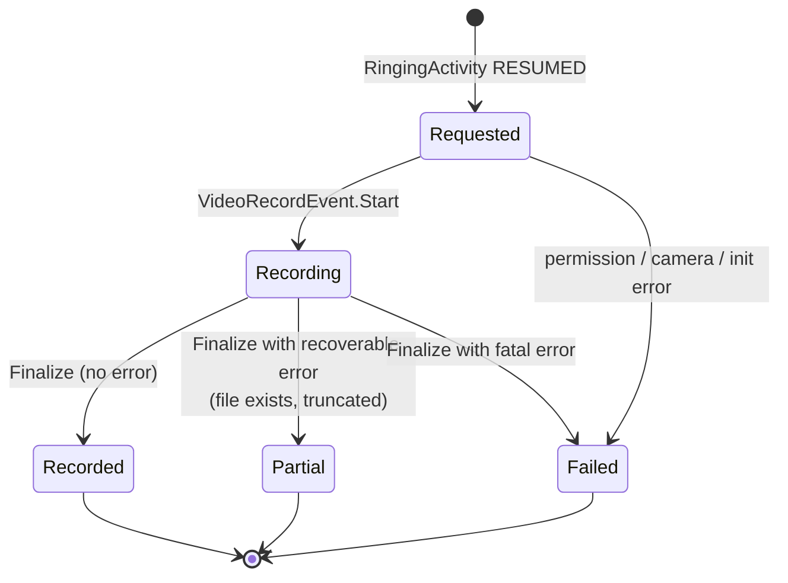
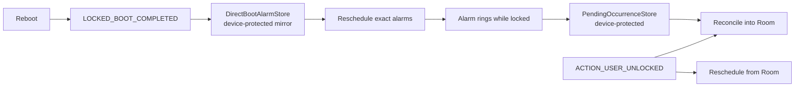

# UpYet — architecture

This document explains *how* the app is put together and *why*. The binding rules live in
[`/AGENTS.md`](../AGENTS.md); this file does not repeat them.

## 1. Layering and module map

Single Gradle module `:app`, organised by feature with explicit platform boundaries:

```text
dev.upyet
├── alarm
│   ├── domain      pure Kotlin: Alarm, Recurrence, NextOccurrenceCalculator, repository interfaces
│   ├── data        Room entities/DAOs/mappers, RoomAlarmRepository
│   ├── scheduling  AlarmScheduler, PendingIntent identity, AlarmReceiver, BootReceiver, rescheduler
│   ├── playback    AlarmPlaybackService, ringtone/vibration/wake lock, ringing session state
│   ├── ringing     RingingActivity, RingingViewModel, RingingScreen
│   └── ui          alarm list + editor
├── evidence
│   ├── domain      AlarmOccurrence, EvidenceSegment, statuses, repository interface
│   ├── data        Room entities/DAOs, EvidenceFileStore, RetentionCleaner
│   ├── camera      EvidenceRecorder (CameraX)
│   └── ui          recording indicator, evidence player
├── history/ui      occurrence list + detail
├── settings        DataStore-backed settings + UI
├── reliability/ui  diagnostics screen
├── core            time, database, directboot, notifications, logging, ui theme
└── navigation      NavHost and routes
```

Dependency direction is always `ui → domain ← data`. Domain code has no Android imports, which is what
makes recurrence and scheduling arithmetic unit-testable on the JVM.

## 2. Alarm scheduling lifecycle



Key properties:

* **One exact alarm per upcoming occurrence.** Recurrence is a rule, never a repeating alarm.
  `setRepeating()` and fixed `+24h` deltas break across DST and manual clock changes.
* **Deterministic identity.** The PendingIntent request code is derived from the alarm id and the
  occurrence kind (main vs snooze), so scheduling twice replaces rather than duplicates, and cancelling
  is exact. This is what makes `schedule`/`cancel` idempotent.
* **Rescheduling triggers**: boot (locked and unlocked), package replacement, `TIME_SET`,
  `TIMEZONE_CHANGED`, user unlock, exact-alarm access restored, and immediately after an alarm fires.
* **Failures are explicit.** `SchedulingResult` is a sealed type; a failed schedule never shows as an
  armed alarm in the UI.

## 3. Ringing lifecycle



Why this split: the service is the only component whose lifetime we control against process death,
window focus, task removal and Activity crashes. Ringing therefore lives entirely in the service, and
the Activity is a replaceable interaction surface. If the Activity never appears (full-screen intent
suppressed, device policy, crash), the alarm still rings and can be dismissed from the notification's
content intent — which opens the Activity rather than short-circuiting the recording experience.

The service also owns a hard timeout: if nobody interacts, it stops itself and the occurrence is
recorded as `TIMED_OUT`.

## 4. Evidence lifecycle



* A segment is created when recording is *requested*; `startedAt` is written only when CameraX emits
  `VideoRecordEvent.Start`. This is why the schema separates `requestedAt`, `startedAt`, `endedAt` and
  `finalizedAt` — pretending recording began at Activity creation would make the evidence dishonest.
* Losing the foreground ends the current segment. Becoming visible again inside the same ringing
  occurrence starts a **new** segment. Occurrence → segments is one-to-many precisely for this reason;
  files are never concatenated during capture, and history plays them in sequence.
* Every failure mode maps to an `EvidenceErrorCode` and is persisted with the occurrence, so the
  history screen can explain what happened instead of showing a blank.
* Dismissal is never gated on the camera: the dismiss path stops playback first and finalizes evidence
  best-effort afterwards.

## 5. Direct Boot strategy



* Alarm-critical components are `directBootAware`. Everything they need before first unlock lives in
  device-protected storage: alarm id, trigger time, snooze minutes, vibration flag, sound URI. Labels
  and history are deliberately *not* mirrored — device-protected storage is not the place for user
  content that is not required to ring.
* Any code reachable before unlock checks `UserManager.isUserUnlocked()` before touching Room or
  DataStore, and the Hilt graph on that path never eagerly constructs the database.
* Occurrences that fire while locked are appended to a device-protected pending list and merged into
  Room when the user unlocks.
* CameraX before first unlock is best-effort only: when it cannot initialize, the occurrence records
  `DIRECT_BOOT_UNAVAILABLE` and ringing/snooze/dismiss behave normally.

## 6. Storage ownership

| Data | Where | Why |
|---|---|---|
| Alarms, occurrences, evidence metadata | Room (credential-protected) | relational queries, migrations, observable Flows |
| Alarm-critical mirror, pending occurrences | device-protected `SharedPreferences` | must be readable before first unlock |
| Settings (retention, defaults) | DataStore Preferences | simple key/value, async, no schema churn |
| Video files | `noBackupFilesDir/evidence/<uuid>.mp4` | app-private, excluded from cloud backup, opaque names |

Room never stores blobs or localized strings. Deleting an occurrence deletes its files through
`EvidenceFileStore`; deleting an alarm leaves its history intact.

## 7. Compose / state architecture

Repository `Flow` → `@HiltViewModel` → immutable `StateFlow<UiState>` → composable → events back to the
ViewModel. `collectAsStateWithLifecycle()` everywhere; no database access or business logic inside
composables; navigation confined to the NavHost. The ringing screen additionally observes the service's
`RingingSessionRegistry` so that UI recreation never affects playback.

## 8. Android platform constraints that shaped the design

* **Exact alarms.** Only `setAlarmClock()` gives an alarm-clock-grade, Doze-exempt, user-visible
  alarm. It also surfaces the next alarm to the system UI. `USE_EXACT_ALARM` is appropriate because
  this app's primary function is an alarm clock.
* **Background activity starts are restricted.** The supported route to a lock-screen alarm UI is a
  high-importance notification with a full-screen intent, plus `setShowWhenLocked`/`setTurnScreenOn` on
  the Activity. Overlays, accessibility services and keyguard dismissal are prohibited.
* **Foreground service types.** Ringing declares `mediaPlayback`; the exact-alarm broadcast grants the
  temporary allowance needed to start it from the receiver. There is deliberately no camera FGS, which
  is what keeps the camera tied to a visible Activity.
* **Camera lifecycle.** CameraX binds to the Activity lifecycle; the OS may take the camera away at any
  time, so evidence is modelled as segments rather than a single guaranteed file.
* **Direct Boot.** Credential-protected storage is unreadable before first unlock, so the alarm path
  cannot depend on Room.
* **Force stop.** A force-stopped app loses its alarms and cannot restart itself; Android offers no
  callback for it. `MainViewModel` therefore re-arms every enabled alarm on each launch — idempotent
  scheduling makes that safe — and the app never uses restart hacks.

## 9. Why the major choices were made

* **Service owns ringing, Activity owns interaction** — the single most important reliability decision;
  it decouples the alarm from Compose, the camera, and window focus.
* **Recurrence as a rule evaluated in local time** — the only way DST, manual clock changes and
  timezone travel behave the way a human expects.
* **Segments instead of one video** — reflects what Android actually guarantees about camera access.
* **Room for metadata, files on disk** — keeps the database small and lets retention deletion be a file
  operation with a metadata update.
* **Single module** — the boundaries that matter here are package-level and lifecycle-level; extra
  Gradle modules would add build complexity without removing coupling.
